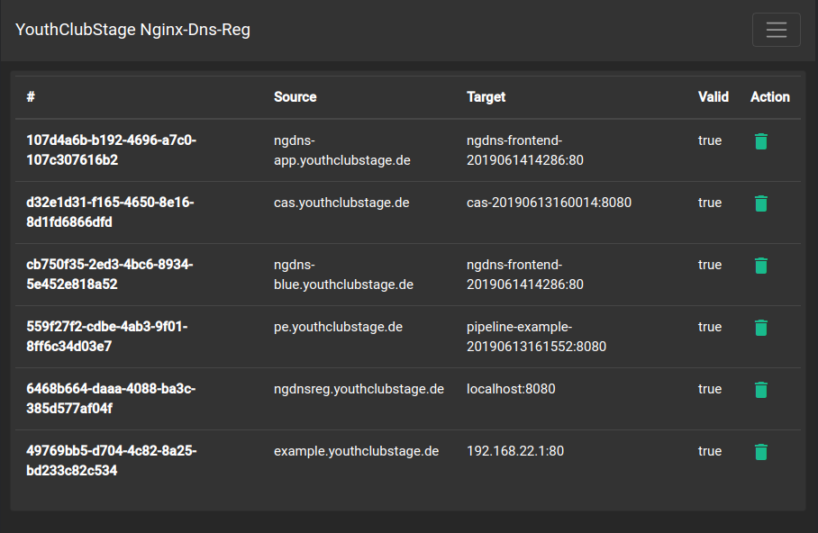
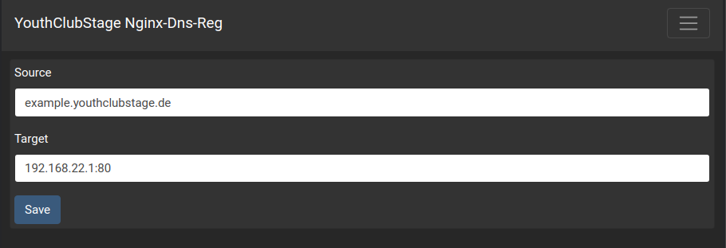

# Nginx Dns Reg App
Ist eine Anwendung zum verwalten der Nginx Routing auf die Docker-Container.
Routen können aber auch auf lokale Entwicklungmaschinen eingerichtet werden,
um die Anwendung mit SSL zu testen.

## Übersicht

## Hinzufügen
